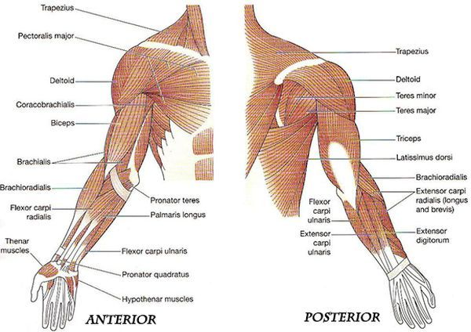
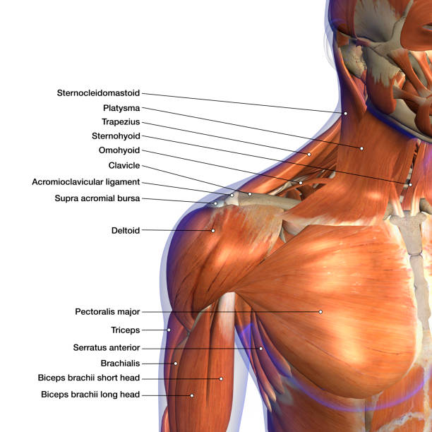

# Testing Data from SC: 

## Experiment
Block-laying task on the wobbling platform -- lifting a 35-lb cinder block (8 x 8 x 16 inches) from the production table (at the left side; at the tronchanterion height) to a simulated wall (at the right side) 
- Two simulated wall heights:
	- at the shoulder height
	- at the elbow height

- Four device conditions:
	- No Exo
	- Lev (Levitate)
	- SX (Suit-X)
	- Ekso (Eksobionic)

## Data Acquisition
The Bertec force plates, kinematics (MOCAP), and EMG were synchronized in Cortex 9, while K-Invent force plates started recording at the moment the subject stepped onto the K-invent force plate. The Mocap and the K-invent force plate were synchronized manually.
- The motion capture system was sampled at 60 Hz.
- The selected range (cutting frames in the Mocap): from the neutral position to task performance and again back to neutral position

### EMG data
Two types of sensors at different sampling frequencies:
- Delsys Avanti: 1259 Hz
- Delsys Quattro: 2222 Hz

Six muscles: Biceps, Triceps, Posterior deltoid, Medial deltoid, Anterior deltoid, Upper trapezius
  
  

#### EMG processing
- Filter
- Rectify and Smooth (RMS)
- Normalize (based on MVC)

#### EMG Analysis (on processed EMG data): 
- Mean and/or Median
- Peak 
- Amplitude Probability Report (idea from Noraxon software): percentage of time at three levels (above, within, and below 20%~30% of MVC)

### Force plate data

### Kinematics data
